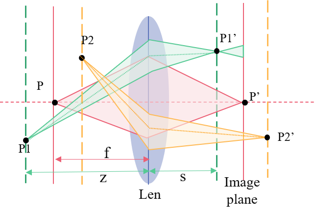
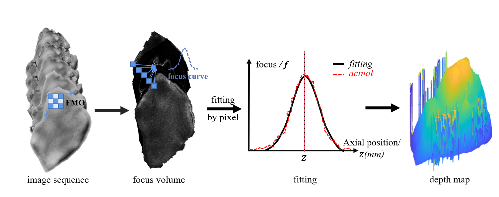
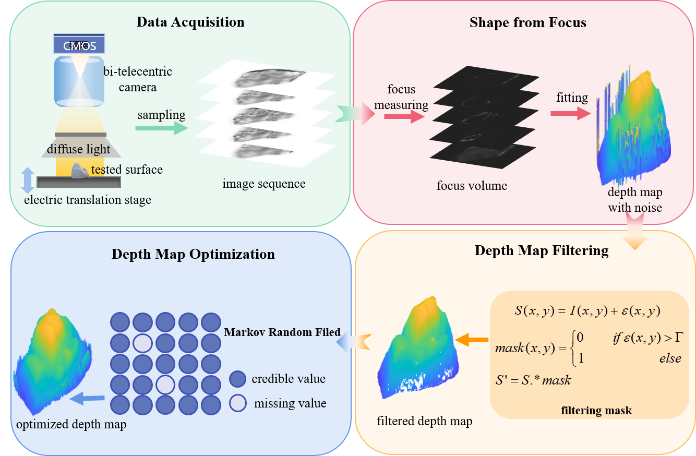
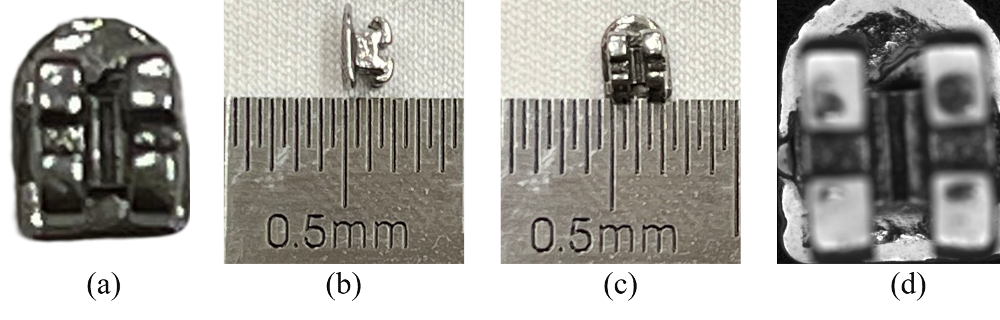
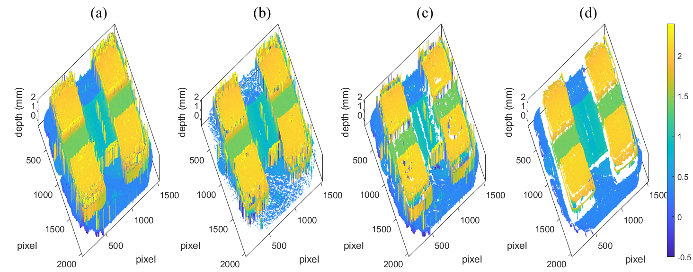
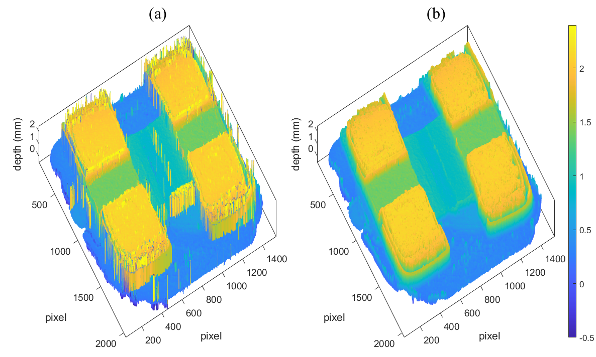

# shape-from-focus
data and code for shape-from-focus for paper: Zhoumiao He, Pei Zhou, Jiangping Zhu, Jianwei Zhang, Improved shape-from-focus reconstruction for high dynamic range freedom surface. OLEN
https://doi.org/10.1016/j.optlaseng.2023.107784

## principle

 

 

## method

 

## result

### measured bracket

 

filtered depth map

 

restored depth map

 

## simu_data
the images with different focuses generated by Blender

## exp_data
the images were captured with the camera Daheng MER2-301-125U3M

## functions
### sffsimu
main function: run this mat to see the result;

### GLVM
the focus measuring operator

### gauss3P
gaussian fit for focus curve

### kstest nicc depthFilter sdd
remove error points

### gradient_descent
global improvement of the depth map

### diplayR1, displayR2
show the results

### WeightedGuidedImageFilter
the compared filter from https://data.mendeley.com/datasets/69n24h6ydh/1.

